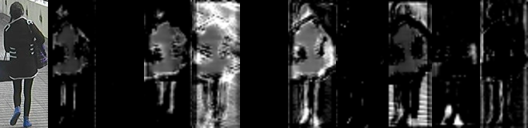
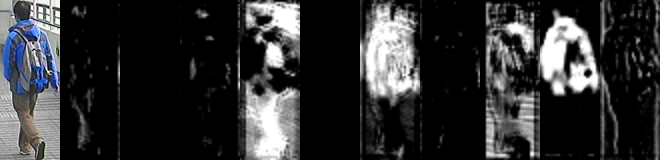
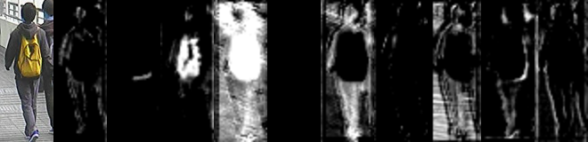

# ccf_feature_extraction
This is a package for person appearance extraction using Convolutional Channel Filter (CCF). We trained <cite>[Ahmed's person identification network][1]</cite> with <cite>[CUHK01][2]</cite> and <cite>[CUHK03][3]</cite> datasets, and take the first two convolutional layers of the network to take advantage of the deep feature representation. You can use it by just including a header file.

[1]:https://www.cv-foundation.org/openaccess/content_cvpr_2015/papers/Ahmed_An_Improved_Deep_2015_CVPR_paper.pdf
[2]:http://www.ee.cuhk.edu.hk/~xgwang/CUHK_identification.html
[3]:http://www.ee.cuhk.edu.hk/~xgwang/CUHK_identification.html

## Requirements
- OpenCV 2 or later
- dlib 19.9

Specify the directory you put dlib as $DLIB_ROOT.

```bash
cd /where/you/want/to/pub/dlib
wget http://dlib.net/files/dlib-19.9.tar.bz2
tar xvf dlib-19.9.tar.bz2
echo "export DLIB_ROOT=\"$(pwd)/dlib-19.9\"" >> ~/.bashrc
source ~/.bashrc
```

## API

```cpp
// This is a header-only library
// You can use it by just including the following header
#include <ccf_feature_extraction/ccf_extractor.hpp>

// You can use CCFs based on the original Ahmed's network (which yields 25 feature maps) or a tiny version of it (10 feature maps)
// ccf::AhmedSubnet subnet(package_dir + "/data/cnn_params");        // original 
ccf::TinyAhmedSubnet subnet(package_dir + "/data/cnn_params_tiny");  // tiny

// Re-order the pixels since the network was trained with RGB pixel order
cv::Mat bgr_image = ...;
cv::cvtColor(bgr_image, rgb_image);

// Extract feature maps using CCF
// Each respose map has CV_32FC1 pixels
std::vector<cv::Mat> responses = subnet(rgb_image);
```

## Example

```bash
roscd ccf_feature_extraction/data/persons/
rosrun ccf_feature_extraction ccf_feature_extraction_test personA.jpg personB.jpg personC.jpg
```

<br>
<br>
<br>
Person images taken from CUHK01.


## Papers
Kenji Koide, Jun Miura, Convolutional Channel Filter-based Person Identification for Person Following Robots, 15th IAS Conference (under review) [PDF].
